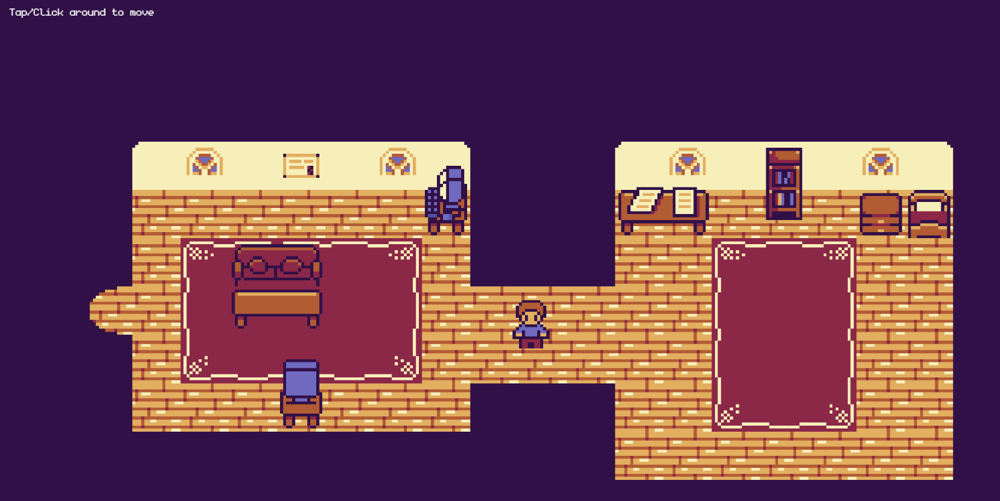

# My portfolio that's a 2D game

I created this portfolio with the help of freeCodeCamp's tutorial.
It's a 2D portfolio project utilizing JavaScript and the kaboom.js library.

Live Demo : https://uk1124.github.io/Utkarsh-Shukla-Portfolio-as-a-2D-game

# How to run

Note: You need `Node.js` and `npm` installed on your machine.

`npm install` then `npm run dev`

# How to build

`npm run build` and a dist folder should be created.

# How to preview the build

`npm run preview`

  

### Credits: JSLegend (https://github.com/JSLegendDev)
